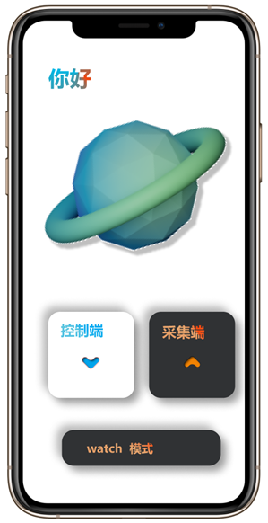
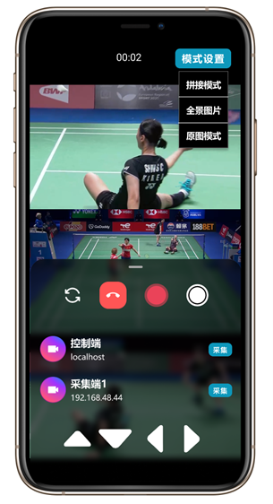
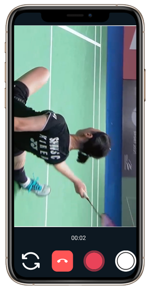
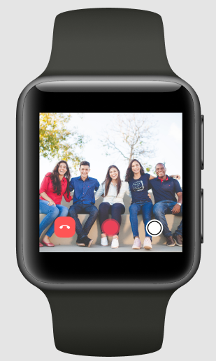
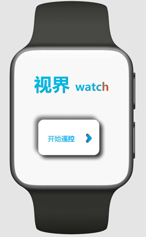

# Vision

[中文简介](README.cn.md)

## Introduction
Vision is a smart image control, acquisition, and fusion solution that integrates the advantages of multiple devices across cell phones, watches, and gimbals.

### If the project is helpful to you, welcome star, fork and pr. If you have any questions, you can add an issue or contact the author by email.

### Achieved functions

(1) Multi-device interconnection: Multiple devices are connected under the same LAN and can be selected as either the acquisition side or the control side. The multi-devices we consider include the cell phone on the control side, the cell phone on the acquisition side, the watch, the gimbal, etc.

(2) Cross-device operation: the acquisition end is responsible for providing camera images to the control end, and at the same time, it can also control its own equipment; the control end can not only view the images of the acquisition end, but also make parameter adjustment, shooting and recording operations on the acquisition end.

(3) One key to operate multiple devices at the same time: the console can control multiple devices with one key to start shooting or recording at the same time to capture images of different angles of a scene.

(4) Real-time display of multiple devices on the same screen: users can choose to view one or more screens that they want to observe.


### Realized scenes

(1) Group photo scenario: designed for remote preview and remote control of shooting, easy to adjust for group photo, which can be applied to the watch side.

(2) Multi-angle capture: can be used for multiple devices to take multi-angle shots of a shooting object, capture the action situation of a moment when in motion, and get a full-view fusion result of a scene

(3) multi-camera recording: can be used as a small guide table when holding small events, to achieve real-time viewing of the multi-camera situation composed of various terminals, switch the angle of multiple devices at any time to record the scene of the event, you can use the integrated face recognition module of the PTZ operation.


### Innovation points

(1) The existing programs all use cloud server as the main data transmission carrier, this project real-time and lossless data transmission are mainly through end-to-end, significantly reducing the pressure on the cloud server

(2) The project takes advantage of multi-device acquisition to realize remote co-production, multi-angle capture, multi-camera recording, and achieve the relevant high-definition integrated fusion effect

(3) The project realizes real-time preview and control of multi-device camera resources to make up for the singularity and fixedness of the existing capture program in the market, while the acquisition end still has independent control

(4) intelligent cell phone end face recognition control PTZ follow

### Screenshots
<div align=center>



</div>

<div align=center>


</div>

## Software architecture
### Branch introduction

1. master branch is the main branch, including the latest version of the code
2. watch branch is a branch adapted to the watch end
3. other branches are intermediate development process branches

### Android source code architecture
```markdown
├─arm_controller gimbals control module
│  ├─commen
│  ├─connect
│  ├─model
│  ├─uitls
│  └─widget
├─bean 
├─entrance 
├─transfer  End-to-end file transfer module
│  ├─adapter
│  ├─app
│  ├─broadcast
│  ├─callback
│  ├─client
│  ├─common
│  ├─map
│  ├─model
│  ├─server
│  ├─util
│  ├─utils
│  └─widget
├─ui 
├─ui_utils 
├─utils
├─view 
├─webRTC_utils 
└─ws WebSocket usage integration
```


## Module detailed design

See [detailed design documentation](doc/Vision详细设计文档.docx)

## Installation tutorial

1. Android Studio import project
2. gradle build
3. configure environment such as head (if needed)
4. run app on devices

## Instructions for use

See [project manual](doc/Vision项目使用手册.docx)


## Contribute

1. fork this repository
2. Create a new Feat_xxx branch
3. commit the code
4. Create a new Pull Request
